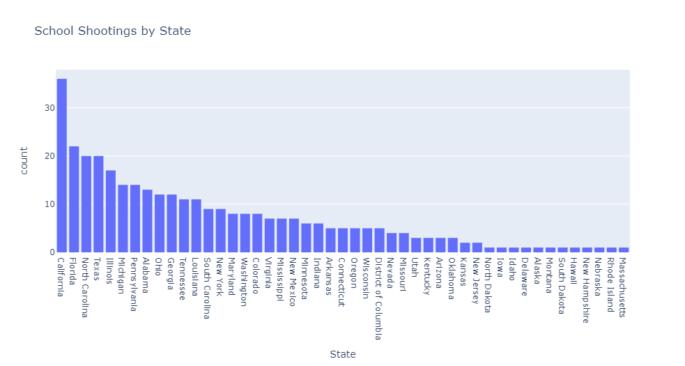
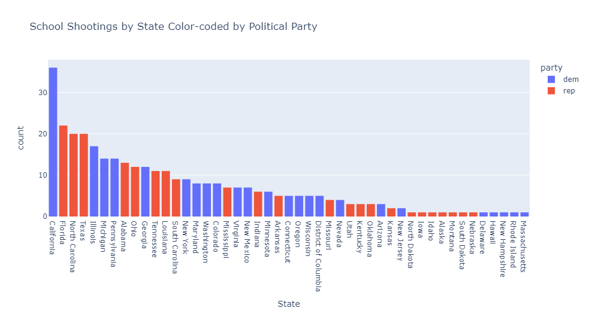
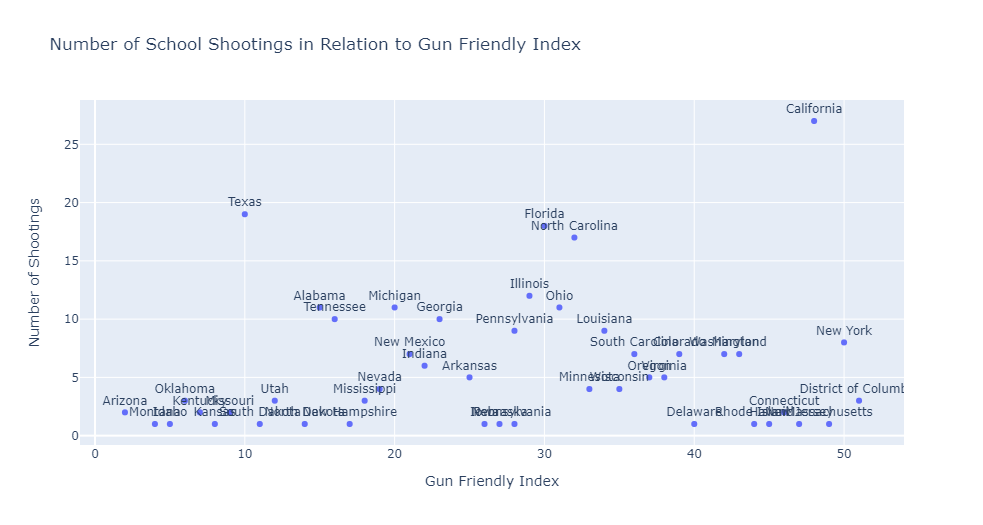
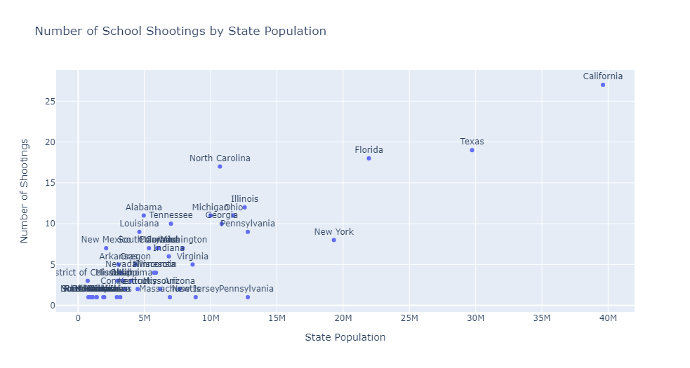
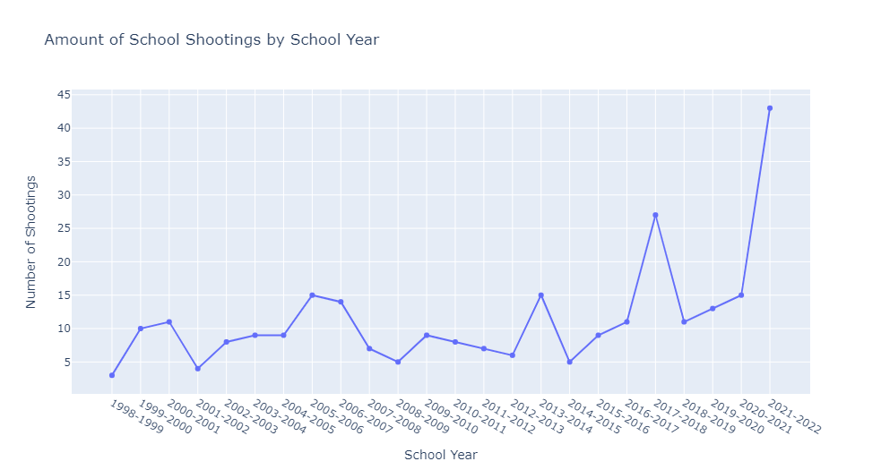

# SchoolShootingStudy
Due to recent tragic events, I figured it would be good to look into a school shooting dataset and see what I could find. 
Since I usually use Plotly in my personal projects, the charts do not automatically display. 
I will post the them here so whoever is reading this can follow along. 

